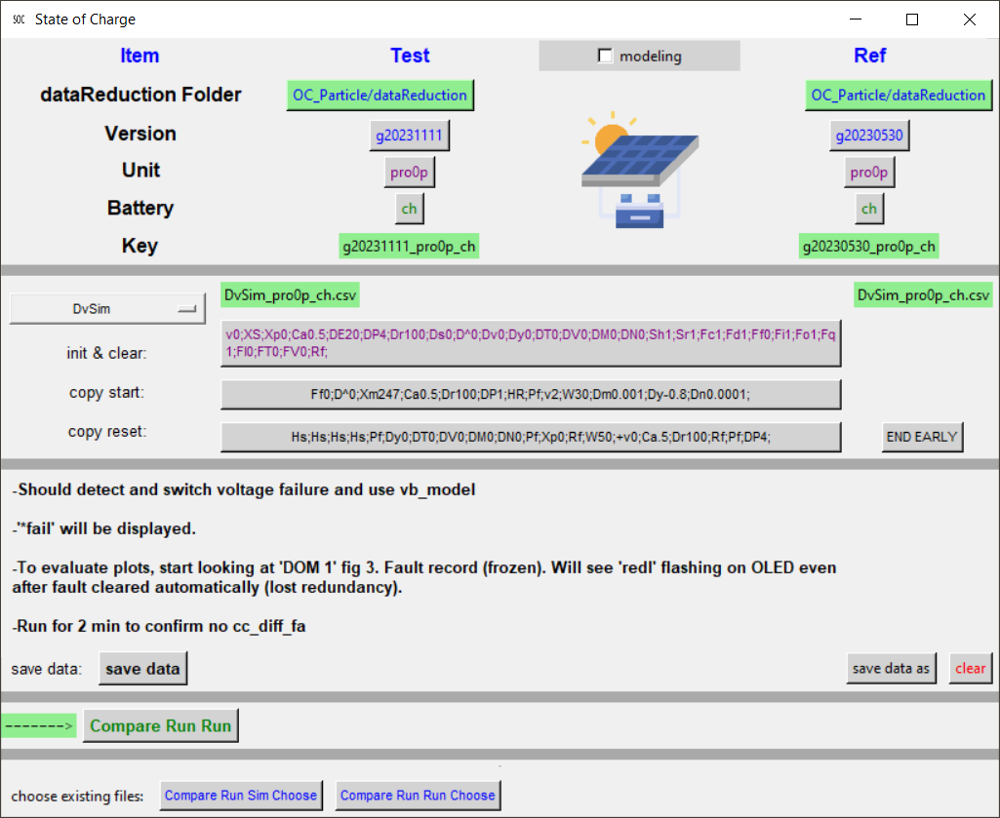

# GUI_TestSOC.py Script to Interface to puTTY Serial Monitor

The Particle devices use the Serial interface to stream text-based data files.   This is done real-time with accurate time stamps allowing very accurate debugging.   I perform debugging by overplotting the results with simulated results using the same sampled data inputs.

The user starts [GUI_TestSOC.py](../py/GUI_TestSOC.py).   Either in the system environment or virtual environment (venv) call Python3.10.10 (lower may work) using the following imports:

```
 python -m pip install --upgrade pip
 python -m pip install configparser
 python -m pip install psutil
 python -m pip install pyperclip
 python -m pip install reportlab
 python -m pip install matplotlib
 python -m pip install easygui
```

Start GUI_TestSOC.py.   A gui like this should appear.

Below [\ref {f1}] is a functional block diagram (FBD) of the user interface.

[\label {f1}] 
 <b>Fig. 1:  Snapshot of Graphical User Interface to Application SOC_Particle</b>

TODO:  ...
